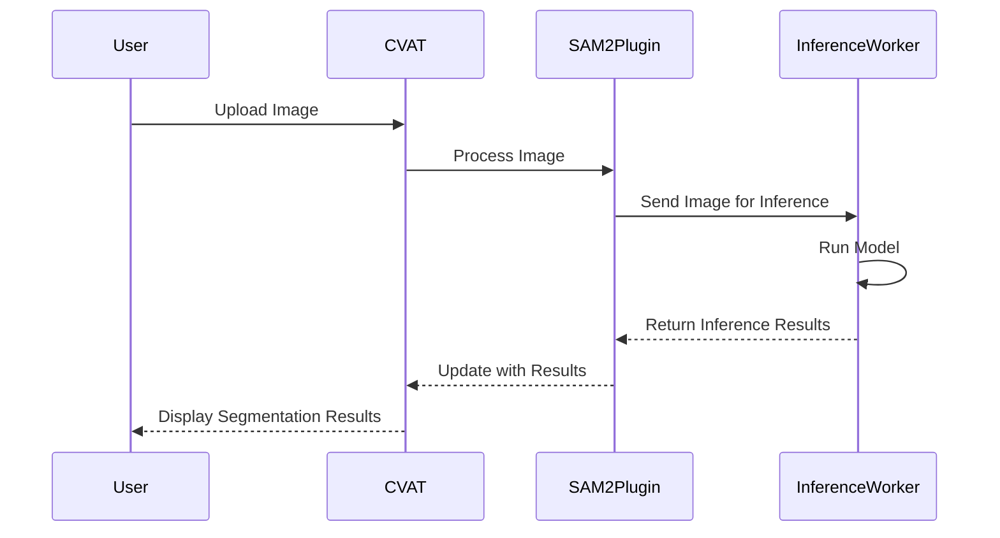

# GitHub Pull Request #8610: INTEGRATE SAM 2.1

**来源**: https://github.com/cvat-ai/cvat/pull/8610

---

### **基本信息**

*   **状态**: Closed (已关闭)
*   **发起者**: `hashJoe`
*   **合并目标**: `hashJoe:feature/sam2` -> `cvat-ai:develop`
*   **包含**: 35 条对话, 23 个提交, 1 个检查, 10 个文件变更 (+768 −1)

---

### **对话内容**

#### **hashJoe 的评论 (2024年10月29日)**

**关联的 ISSUES:**
*   Replace SAM with SAM 2 #8231

**关联的 PULL REQUESTS:**
*   Introduce Segment Anything 2 #8243

**摘要**

为了将 SAM 2.1 集成到 CVAT 中，我：
1.  fork 了 cvat,
2.  创建了分支 `feature/sam2`,
3.  合并了 @jeanchristopheruel 的 forked 仓库并将 `develop` 分支合并到 `feature/sam2` 中,
4.  将 SAM 2.0 更新到 SAM 2.1,
5.  使用脚本 `export_sam21_cvat.py` 将解码器部分转换为 ONNX,
6.  将代码拆分为后端和前端,
7.  添加了 `CLIENT_PLUGINS` 参数以传递插件 `cvat-ui/plugins/sam2`,
8.  并在 CVAT 内成功地在 CPU 和 GPU 上测试了模型。

**动机和背景**

此 pull request 建立在 #8243 的基础上，该请求旨在将 SAM 2 集成到 CVAT 中。该贡献的进展已停滞，此请求作为集成 SAM 2 的延续。

**主要增强功能:**
*   更新到 SAM 2.1
*   后端对图像进行编码
*   解码器转换为 ONNX 并包含后处理步骤
*   前端进行解码

通过这种方式，以最小的改动在 SAM 2 中保持了集成 SAM 的结构。

**如何测试?**

使用以下命令：
```bash
CLIENT_PLUGINS=plugins/sam2 CVAT_HOST=localhost CVAT_VERSION=v2.21.2 docker compose -f docker-compose.yml -f docker-compose.dev.yml -f components/serverless/docker-compose.serverless.yml -p cvat up -d --build

# on cpu
./serverless/deploy_cpu.sh serverless/pytorch/facebookresearch/sam2

# on gpu
./serverless/deploy_gpu.sh serverless/pytorch/facebookresearch/sam2
```
并在多个图像上应用该模型。

**检查清单**
*   [x] 我将我的更改提交到 `develop` 分支
*   [x] 我创建了一个 changelog 片段
*   [x] 我相应地更新了文档
*   [ ] 我添加了测试来覆盖我的更改
*   [x] 我链接了相关问题 (参见 GitHub 文档)
*   [ ] 如果需要，我增加了 npm 包的版本 (`cvat-canvas`, `cvat-core`, `cvat-data` 和 `cvat-ui`)

**许可证**
*   [x] 我在与项目相同的 MIT 许可证下提交我的代码更改。如果对此有疑虑，请随时联系维护者。

---

#### **CodeRabbit 的摘要**

**发布说明**
*   **新功能**
    *   增强了计算机视觉标注工具 (CVAT) 的文档，更新了关于自动标注算法和用户支持渠道的部分。
    *   为 Segment Anything Model 2.1 (SAM2) 引入了一个新插件，以促进交互式分割任务。
    *   为使用 SAM2 进行交互式对象分割添加了无服务器函数配置。
*   **错误修复**
    *   修正了文档中的格式问题。
*   **杂项**
    *   通过新的构建参数改进了 CVAT UI 服务的可配置性。

---

#### **提交记录 (23个)**

*   `e2b9624`: Introduce Segment Anything 2.0 for GPU only. …
*   `d482fd9`: Create a changelog fragment
*   `8cff678`: remove useless docstring
*   `ac89a2f`: fix readme regarding CPU capabilities for SAM2
*   `a2ce34f`: reduce the default number of cpu workers to 1
*   `32a9b22`: add a try catch block as suggested by coderabbitai
*   `bf650ab`: remove data logs in main
*   `643081f`: fix: introduce sam2 on cpu
*   `6dd2eb7`: fix: use newest installation mewthod from facebook. (configs files ar… …
*   `288bdcf`: update docs -> SAM2 now supports CPU
*   `158dbba`: fix linter errors
*   `618ffbf`: Update 20240731_000641_ruelj2.md
*   `2f4979f`: Merge branch 'jeanchristopheruel/sam2' into feature/sam2
*   `bfcc5e2`: WIP: pass env CLIENT_PLUGINS to cvat_ui args in docker-compose.dev.ym… …
*   `ffe6f50`: WIP: start working on frontend errors, backend should be okay
*   `f562adc`: WIP: rework backend to include high_res_feats_0 and high_res_feats_1 … …
*   `92d20ac`: add new inputs (high_res_feat0, high_res_feat1) and do corresponding … …
*   `d5a9766`: clean code
*   `f232eac`: clean code
*   `bae57fb`: update README.md
*   `1f506aa`: update docker-compose.dev.yml
*   `d027a6a`: fix function-gpu.yaml
*   `0a8d038`: fix pip install in function-gpu.yaml

---

#### **CodeRabbitAI Bot 的评论 (2024年10月29日)**

**演练**
此 pull request 中的更改涉及对文档的更新以及为计算机视觉标注工具 (CVAT) 引入新功能。`README.md` 文件通过新部分和澄清得到了增强。此外，还添加了几个新文件，包括 Segment Anything Model 2.1 的插件、用于推理任务的 web worker 以及无服务器函数的配置。这些更改共同提高了工具的功能，特别是在对象分割和模型推理方面。

**文件变更摘要**
*   `README.md`: 添加了新部分并更新了现有内容。
*   `cvat-ui/plugins/sam2/src/ts/index.tsx`: 引入了 `SAM2Plugin` 接口，添加了插件功能和错误处理的方法。
*   `cvat-ui/plugins/sam2/src/ts/inference.worker.ts`: 添加了用于推理任务的 web worker。
*   `docker-compose.dev.yml`: 向 `cvat_ui` 服务添加了 `CLIENT_PLUGINS` 参数。
*   `serverless/pytorch/facebookresearch/sam2/nuclio/function-gpu.yaml`: 为使用 SAM2 的交互式对象分割定义了无服务器函数配置。
*   `serverless/pytorch/facebookresearch/sam2/nuclio/function.yaml`: 引入了使用 SAM2 进行交互式分割的无服务器函数配置。
*   `serverless/pytorch/facebookresearch/sam2/nuclio/image_encoder.py`: 添加了 `SAM2Encoder` 类。
*   `serverless/pytorch/facebookresearch/sam2/nuclio/main.py`: 引入了用于图像处理的主无服务器函数。
*   `serverless/pytorch/facebookresearch/sam2/nuclio/model_handler.py`: 添加了 `ModelHandler` 类来管理 SAM2 模型。

**序列图**


---

#### **SonarQubeCloud Bot 的评论 (2024年10月29日)**

**质量门失败**
失败条件：新代码重复率为 32.3% (要求 ≤ 3%)。

---

#### **CodeRabbitAI Bot 的代码审查 (2024年10月29日)**

(摘要了部分关键建议)

*   **`image_encoder.py`**: 建议为 `SAM2Encoder` 类添加文档字符串，并改进 `forward` 方法的类型提示和文档。建议添加输入验证和形状断言。
*   **`model_handler.py`**: 建议移除不必要的空行，考虑架构改进（如异步处理、健康检查），将模型路径设为可配置，并为模型初始化添加错误处理和日志记录。
*   **`function.yaml`**: 建议更新帮助信息和示例 GIF 以适应 SAM 2.1，考虑更新 Python 运行时版本，并优化 Docker 镜像大小。
*   **`function-gpu.yaml`**: 建议更新演示 GIF 和帮助信息。
*   **`docker-compose.dev.yml`**: 建议为 `CLIENT_PLUGINS` 添加默认值。
*   **`README.md`**: 建议添加关于 ONNX 转换的文档。
*   **`main.py`**: 建议移除未使用的变量 `image_`。
*   **`inference.worker.ts`**: 建议避免无理由地禁用 ESLint 规则。
*   **`index.tsx`**: 指出了多处潜在问题，包括不正确的对象属性赋值、覆盖 `worker.onmessage`、比较数组时的边缘情况处理、访问数组元素前缺少长度检查，并建议优化 `toMatImage` 函数的性能。

---

#### **jeanchristopheruel 的评论 (2024年10月29日)**

干得非常漂亮 @hashJoe！我认为下一个重要的里程碑将是在前端集成编码器，以解锁视频标注的去中心化跟踪功能（这基本上就是 SAM2 的全部意义所在）！

---

#### **hashJoe 的回复 (2024年10月29日)**

@jeanchristopheruel 我需要研究一下视频预测，并检查如何在 CVAT 中实现它。在前端集成编码器会有什么帮助？这里有一个在后端完成的跟踪模型示例（编码器和解码器都在后端）。任何见解都会有帮助！

---

#### **jeanchristopheruel 的回复 (2024年10月29日)**

@hashJoe 我相信 Sam2 编码器足够轻量，可以由前端支持（我记得大约是 1Gb）。将其移植到前端将不再需要推理后端服务器。此外，它还将减少与包含状态和返回嵌入的请求相关的延迟。视频标注将比以往任何时候都快。每个用户都有自己的内部跟踪状态，这在 Sam2 中是一个内存嵌入。

---

#### **youho99 的评论 (2024年11月4日)**

我正在关注这个 PR。

---

#### **corkwing 的评论 (2024年11月5日)**

用于视频跟踪的 SAM 2 将真正改变我们的标注工作流程（鱼类监测）！我希望这能在 CVAT 中实现。

---

#### **bsekachev (成员) 的评论 (2025年1月22日)**

大家好，
我们有我们企业版的 SAM2 分割器和跟踪器，并且可能不会合并这个 pull request，因为我们不想同时支持两个版本。
无论如何，感谢您的贡献。我相信它会对社区有所帮助。

*(此评论收到了 8 个 👎 和 1 个 👀 的反应)*

---

#### **bsekachev 关闭了这个 PR (2025年1月22日)**

---

#### **vijayreddysamula 的评论 (2025年2月17日)**

嗨 @hashJoe,
感谢您在 CVAT 中实现 SAM 2.1。这是一个伟大的创举。我 fork 了您的仓库并尝试了 sam2.1，但在标注过程中遇到了问题，生成的掩码没有在我点击的正确位置。您能帮我解决这个问题吗？

---

#### **hashJoe 的回复 (2025年2月17日)**

嘿，掩码是如何生成的？它应该能正常工作，我仍在我的仓库中按实现的方式使用它。它的缩放比例是否不同？

---

#### **natanaels12 的评论 (2025年2月18日)**

我认为对于 1:1 的图像，点是正常的，但如果图像有不同的比例（例如 4:3），发送的点提示就会偏离。可能与 `index.tsx` 没有正确计算点坐标有关。

---

#### **vijayreddysamula 的评论 (2025年2月18日)**

感谢回复 @hashJoe @natanaels12
图像有不同的比例（不是 1:1）。分辨率是 1920 X 1200。当我点击一个点时，它在另一个地方进行了标注。

---

#### **hashJoe 的回复 (2025年2月23日)**

> ...
这个问题已经通过 [这个提交](https://github.com/hashJoe/cvat/commit/387013616130313861303138613031386130313861303138) 修复了。
问题在于图像总是被调整为正方形，忽略了其原始的宽高比，如[这里](https://github.com/hashJoe/cvat/blob/387013616130313861303138613031386130313861303138/serverless/pytorch/facebookresearch/sam2/nuclio/model_handler.py#L32)所示。
同时，前端的点坐标在缩放时保留了宽高比，如[这里](https://github.com/hashJoe/cvat/blob/387013616130313861303138613031386130313861303138/cvat-ui/src/plugins/sam2/ts/index.tsx#L275)所示。
另一种解决方案是使用填充进行缩放以保持宽高比。我尝试了这种方法并重新导出了解码器，但可视化仍然有问题，很可能是由于前端的后处理。
然而，这个解决方案也应该能工作。

---

#### **yves-ran 的评论 (2025年2月24日)**

我想关注这个帖子。

---

#### **vijayreddysamula 的评论 (2025年2月27日)**

嗨 @hashJoe,
问题现在通过这个提交修复了。现在它无缝工作。感谢您的快速回复和更新。